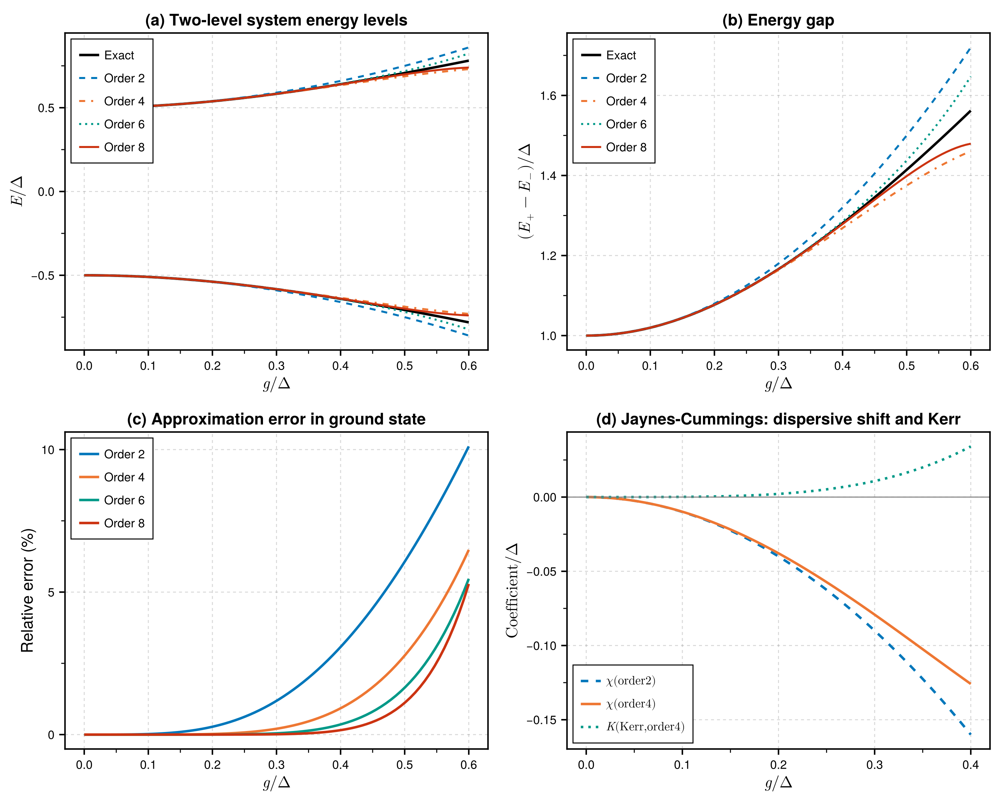
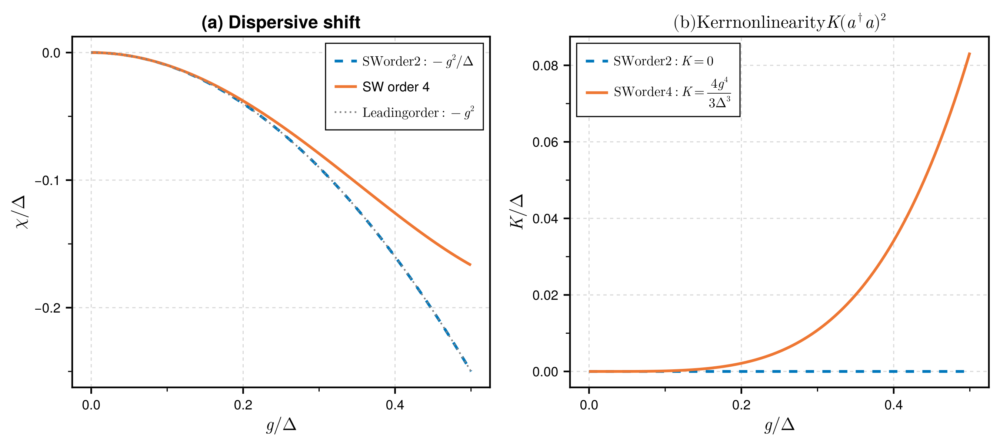
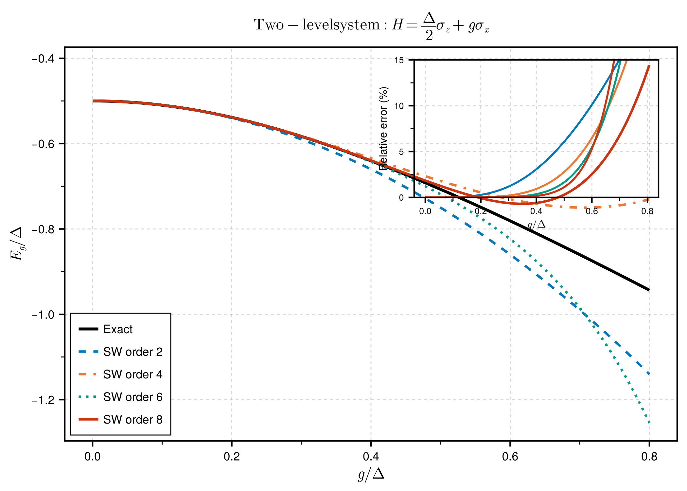
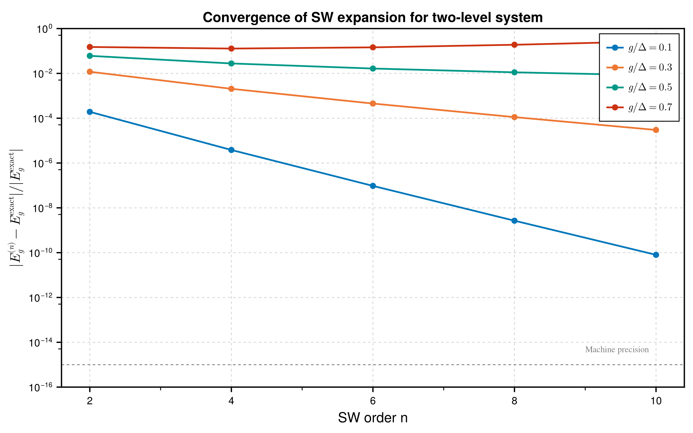
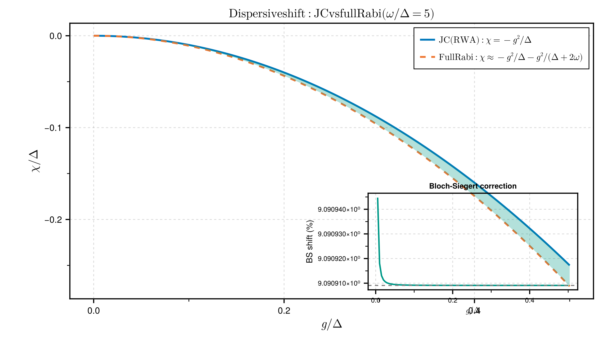

# [Schrieffer-Wolff Transformation](@id schrieffer_wolff)

The **Schrieffer-Wolff (SW) transformation** is a perturbative method for block-diagonalizing Hamiltonians with well-separated energy scales. It was introduced by Schrieffer and Wolff in 1966 to derive the Kondo exchange interaction from the Anderson impurity model.

---

## Theory

### The Problem

Consider a Hamiltonian of the form:

```math
H = H_0 + V
```

where:
- ``H_0`` is the **unperturbed Hamiltonian** with known eigenstates grouped into low-energy (``P``) and high-energy (``Q``) sectors
- ``V`` is a **perturbation** that couples the ``P`` and ``Q`` sectors

We want to find an effective Hamiltonian ``H_{\text{eff}}`` that:
1. Acts only within the low-energy sector ``P``
2. Captures the effects of ``V`` to a given order in perturbation theory

### The Transformation

We seek a unitary ``U = e^S`` such that the transformed Hamiltonian:

```math
H_{\text{eff}} = e^S H e^{-S}
```

is **block-diagonal** with respect to the ``P`` and ``Q`` subspaces. This means ``H_{\text{eff}}`` has no matrix elements connecting ``P`` and ``Q``.

When ``U = e^S`` for some anti-Hermitian generator ``S`` (i.e., ``S^\dagger = -S``), the transformed Hamiltonian can be expanded using the **Baker-Campbell-Hausdorff (BCH) formula**:

```math
e^S H e^{-S} = H + [S, H] + \frac{1}{2!}[S, [S, H]] + \frac{1}{3!}[S, [S, [S, H]]] + \cdots
```

### Determining the Generator

Decompose the Hamiltonian and generator into block-diagonal and off-block-diagonal parts:

```math
H = H_d + V_{od}, \quad S = S_{od}
```

where:
- ``H_d = P H P + Q H Q`` (block-diagonal)
- ``V_{od} = P H Q + Q H P`` (off-block-diagonal)
- ``S_{od}`` is purely off-block-diagonal (anti-Hermitian)

The **generator equation** at first order is:

```math
[S, H_d] = -V_{od}
```

This is the fundamental equation that determines ``S``. It states that the commutator of ``S`` with the diagonal Hamiltonian must cancel the off-diagonal perturbation.

### Solving the Generator Equation

For operators ``O`` that are **eigenoperators** of the adjoint action of ``H_d``—meaning ``[H_d, O] = \varepsilon \cdot O`` for some energy ``\varepsilon``—the solution is:

```math
S = \sum_\alpha \frac{V_\alpha}{\varepsilon_\alpha}
```

where ``V_\alpha`` are the components of ``V_{od}`` and ``\varepsilon_\alpha`` are the corresponding energy denominators.

**Example**: For a two-level system with ``H_d = \frac{\Delta}{2}\sigma_z`` and ``V_{od} = g\,\sigma^+``:
- ``[\sigma_z, \sigma^+] = 2\sigma^+``, so ``[H_d, \sigma^+] = \Delta\,\sigma^+``
- Therefore ``S = \frac{g}{\Delta}\sigma^+`` (plus Hermitian conjugate for the ``\sigma^-`` term)

### The Effective Hamiltonian

Using the BCH expansion:

```math
H_{\text{eff}} = H_d + \frac{1}{2}[S, V_{od}] + O(V^3)
```

The key second-order contribution is:

```math
H^{(2)} = \frac{1}{2}[S, V_{od}]
```

This generates effective interactions within the low-energy sector that arise from virtual transitions to high-energy states.

### Physical Interpretation

The SW transformation captures the physics of **virtual processes**:

1. The system starts in the low-energy sector ``P``
2. The perturbation ``V`` virtually excites it to high-energy sector ``Q``
3. The system returns to ``P`` via another application of ``V``

This virtual excitation costs energy ``\Delta E`` and contributes to the effective Hamiltonian as ``\sim V^2/\Delta E``.

### Order-by-Order Expansion

At higher orders, the SW transformation proceeds iteratively:

| Order | Contribution | Energy dependence |
|-------|--------------|-------------------|
| 0 | ``H_d`` | Original diagonal |
| 2 | ``\frac{1}{2}[S_1, V]`` | ``\sim g^2/\Delta`` |
| 3 | ``\frac{1}{2}[S_1, [S_1, H_d]] + [S_2, V]`` | ``\sim g^3/\Delta^2`` |
| 4 | Higher nested commutators | ``\sim g^4/\Delta^3`` |

Each order adds terms suppressed by additional powers of ``g/\Delta``.

### Eigenoperator Method

This package implements two methods for solving the generator equation. The **eigenoperator method** works for operators that satisfy:

```math
[H_d, O] = \varepsilon \cdot O
```

Such operators are called **eigenoperators** of the Liouvillian ``\mathcal{L}_{H_d}(\cdot) = [H_d, \cdot]``.

#### Examples of Eigenoperators

| System | Operator | Eigenvalue |
|--------|----------|------------|
| TLS: ``H_d = \frac{\Delta}{2}\sigma_z`` | ``\sigma^+`` | ``+\Delta`` |
| | ``\sigma^-`` | ``-\Delta`` |
| Cavity: ``H_d = \omega a^\dagger a`` | ``a^\dagger`` | ``+\omega`` |
| | ``a`` | ``-\omega`` |
| N-level: ``H_d = \sum_i E_i \vert i\rangle\langle i\vert`` | ``\vert i\rangle\langle j\vert`` | ``E_i - E_j`` |

For these operators, the generator is simply:

```math
S = \frac{O}{\varepsilon}
```

#### Composite Operators

Products of eigenoperators are also eigenoperators with additive eigenvalues:

```math
[H_d, O_1 O_2] = (\varepsilon_1 + \varepsilon_2) O_1 O_2
```

**Example**: For the Jaynes-Cummings interaction ``a^\dagger \sigma^-``:
- ``[H_d, a^\dagger \sigma^-] = (\omega_c - \Delta) a^\dagger \sigma^-``
- Energy denominator: ``\omega_c - \Delta`` (the detuning)

### Matrix-Element Method for Lie Algebras

For SU(N) systems expressed in the Gell-Mann basis, the generators are **not eigenoperators** of the diagonal Hamiltonian. For example:

```math
[\lambda_8, \lambda_2] \neq c \cdot \lambda_2
```

Instead, the commutator produces a linear combination of generators.

The solution is to work in the **Cartan-Weyl basis**, where the off-diagonal generators are replaced by transition operators:

| Gell-Mann | Cartan-Weyl |
|-----------|-------------|
| ``\lambda_1, \lambda_4`` | ``E_{12} = \vert 1\rangle\langle 2\vert``, ``E_{21} = \vert 2\rangle\langle 1\vert`` |
| ``\lambda_2, \lambda_5`` | ``E_{13} = \vert 1\rangle\langle 3\vert``, ``E_{31} = \vert 3\rangle\langle 1\vert`` |
| ``\lambda_3, \lambda_6`` | ``E_{23} = \vert 2\rangle\langle 3\vert``, ``E_{32} = \vert 3\rangle\langle 2\vert`` |

The transition operators **are** eigenoperators:

```math
[H_d, \vert i\rangle\langle j\vert] = (E_i - E_j)\vert i\rangle\langle j\vert
```

**Algorithm:**
1. Compute energy eigenvalues ``E_i`` from the diagonal Hamiltonian
2. Convert ``V_{od}`` from Gell-Mann to Cartan-Weyl basis
3. Apply inverse Liouvillian: ``S_{ij} = V_{ij} / (E_i - E_j)``
4. Convert ``S`` back to Gell-Mann basis

This is implemented in `solve_for_generator_lie()`.

### Energy Denominators

The energy denominators in SW transformations have important physical meaning:

#### Resonance Condition

When an energy denominator approaches zero (``\varepsilon \to 0``), the perturbation theory breaks down. This indicates a **resonance** where the two sectors are no longer well-separated.

#### Example: Dispersive Regime

In circuit QED, the Jaynes-Cummings Hamiltonian has energy denominator ``\Delta = \omega_q - \omega_c``. The dispersive approximation is valid when:

```math
|g| \ll |\Delta|
```

The effective Hamiltonian contains the dispersive shift:

```math
\chi = -\frac{g^2}{\Delta}
```

This diverges as ``\Delta \to 0`` (resonance), signaling the breakdown of the perturbative treatment.

---

## How-To Guide

This section walks through using the Schrieffer-Wolff transformation step by step.

### Step 1: Set Up the System

Let's work with a concrete example: a two-level system (qubit) coupled to a harmonic oscillator (the Jaynes-Cummings model).

```julia
using UnitaryTransformations
using QuantumAlgebra
using Symbolics

# Use σ± basis - important for SW to work correctly with spins
QuantumAlgebra.use_σpm(true)

# Define symbolic parameters
@variables Δ g  # Δ = qubit-oscillator detuning, g = coupling strength

# Jaynes-Cummings Hamiltonian (in rotating frame)
H = Δ/2 * σz() + g * (a'()*σm() + a()*σp())
```

The Hamiltonian describes:
- A qubit with splitting ``\Delta`` (the ``\sigma_z`` term)
- Coupling to an oscillator mode (the ``a^\dagger \sigma^-`` and ``a \sigma^+`` terms)

### Step 2: Define the Subspace

We need to specify which states belong to the low-energy subspace ``P``. For this example, we choose the qubit ground state:

```julia
# P = states where σz = -1 (qubit in ground state |g⟩)
P = Subspace(σz() => -1)
```

The `Subspace` type specifies expectation values of operators in the subspace. Here, we say that in subspace ``P``, the operator ``\sigma_z`` has eigenvalue ``-1``.

#### Multiple Constraints

For more complex systems, you can specify multiple constraints:

```julia
# Subspace with qubit ground state AND zero photons
P = Subspace(σz() => -1, a'()*a() => 0)
```

### Step 3: Understand the Decomposition

The SW transformation requires splitting ``H`` into diagonal and off-diagonal parts with respect to ``P``:

```julia
H_d, V_od = decompose(H, P)

println("Diagonal:     ", H_d)
println("Off-diagonal: ", V_od)
```

Output:
```
Diagonal:     -0.5Δ + Δ σ⁺σ⁻
Off-diagonal: g a†σ⁻ + g a σ⁺
```

- **Diagonal** (``H_d``): Operators that don't change the subspace (like ``\sigma^+\sigma^-``, ``a^\dagger a``)
- **Off-diagonal** (``V_{od}``): Operators that connect ``P`` and ``Q`` subspaces (like ``\sigma^+``, ``\sigma^-``)

### Step 4: Perform the Transformation

Now apply the Schrieffer-Wolff transformation:

```julia
result = schrieffer_wolff(H, P; order=2)
```

This returns a named tuple with:
- `result.S` - The generator of the unitary transformation ``e^S``
- `result.H_eff` - The block-diagonal effective Hamiltonian
- `result.H_P` - The effective Hamiltonian projected onto subspace ``P``

#### Higher Orders

You can go to higher orders for more accuracy:

```julia
result_4th = schrieffer_wolff(H, P; order=4)
```

For orders 4 and above, enable parallel computation for better performance:

```julia
# Start Julia with threads: julia -t 4
result_4th = schrieffer_wolff(H, P; order=4, parallel=true)
```

| Order | Approx. Time | Physics Captured |
|-------|--------------|------------------|
| 2 | ~50 ms | Dispersive shifts |
| 4 | ~0.4 s | Kerr nonlinearity, Bloch-Siegert |
| 5 | ~1.5 s | Higher-order corrections |
| 6 | ~50 s | Research applications |

**Simplification modes**: Control the speed/simplification trade-off:

```julia
# Fastest: no simplification (expressions may be verbose)
result = schrieffer_wolff(H, P; order=4, simplify_mode=:none)

# Default: fast expansion (recommended)
result = schrieffer_wolff(H, P; order=4, simplify_mode=:fast)

# Thorough: full algebraic simplification (slower)
result = schrieffer_wolff(H, P; order=4, simplify_mode=:standard)
```

### Step 5: Analyze the Results

#### The Generator

```julia
println("Generator S = ", result.S)
# S = (g/Δ) a†σ⁻ + (-g/Δ) a σ⁺
```

The generator ``S`` is anti-Hermitian (``S^\dagger = -S``) and satisfies:

```math
[S, H_d] = -V_{od}
```

#### The Effective Hamiltonian

```julia
# Collect and display all terms with simplified coefficients
terms = collect_terms(result.H_eff)
for (op, coeff) in terms
    println("  ", coeff, "  ", op)
end
```

Output:
```
  -0.5Δ        𝟙
  -(g²)/Δ      a†a
  Δ + (g²)/Δ   σ⁺σ⁻
  ...
```

#### The Projected Hamiltonian

For many applications, we only care about the subspace ``P``:

```julia
println("H_P = ", result.H_P)
# H_P = -0.5Δ + (-(g²)/Δ) a†a
```

This is the **dispersive Hamiltonian**: the cavity frequency is shifted by ``-g^2/\Delta`` when the qubit is in the ground state!

### Step 6: Extract Physical Parameters

Use utility functions to extract specific coefficients:

```julia
# Get the dispersive shift (coefficient of a†a)
χ = extract_coefficient(result.H_P, a'()*a())
println("Dispersive shift χ = ", χ)
# Output: -(g²)/Δ
```

### Step 7: Numerical Evaluation

Substitute numerical values to get concrete numbers:

```julia
H_numeric = substitute_values(result.H_P, Dict(:g => 0.1, :Δ => 1.0))
println("H_P with g=0.1, Δ=1.0: ", H_numeric)
```

### Step 8: LaTeX Output

For publications and documentation, you can output results in LaTeX:

```julia
# Convert a single expression to LaTeX
println(to_latex(result.H_P))
# Output: - \frac{1}{2} \Delta + \frac{-g^{2}}{\Delta} {a}^{\dagger} {a}

# Pretty-print with a name
print_latex(result.H_P; name="H_P")
# Output: H_P = - \frac{1}{2} \Delta + \frac{-g^{2}}{\Delta} {a}^{\dagger} {a}

# Show all components of the result
show_result(result)
```

### Complete Example

Here's the full code:

```julia
using UnitaryTransformations
using QuantumAlgebra
using Symbolics

# Setup
QuantumAlgebra.use_σpm(true)

# Define symbolic parameters and Hamiltonian
@variables Δ g
H = Δ/2 * σz() + g * (a'()*σm() + a()*σp())

# Define subspace and transform
P = Subspace(σz() => -1)
result = schrieffer_wolff(H, P; order=2)

# Analyze results
println("Effective Hamiltonian in ground state subspace:")
for (op, coeff) in collect_terms(result.H_P)
    println("  ", coeff, "  ", op)
end

# Extract dispersive shift
χ = extract_coefficient(result.H_P, a'()*a())
println("\nDispersive shift: χ = ", χ)
println("Expected: -g²/Δ")
```

---

## Examples

### Convergence Analysis

The following figure demonstrates how higher-order SW transformations systematically improve the accuracy of the effective Hamiltonian:



**Key observations:**
- **Panel (a)**: Energy levels of a two-level system. Higher orders capture the curvature better.
- **Panel (b)**: The energy gap ``E_+ - E_-`` approaches the exact ``\sqrt{\Delta^2 + 4\varepsilon^2}`` with higher orders.
- **Panel (c)**: Relative error decreases with increasing SW order.
- **Panel (d)**: Jaynes-Cummings model showing dispersive shift ``\chi`` and Kerr nonlinearity ``K`` (only present at order 4+).

### Jaynes-Cummings: Dispersive Regime

The Jaynes-Cummings model describes a two-level atom coupled to a single cavity mode:

```math
H = \omega_c a^\dagger a + \frac{\omega_q}{2}\sigma_z + g(a^\dagger\sigma^- + a\sigma^+)
```

In the **dispersive regime** (``|\Delta| = |\omega_q - \omega_c| \gg g``), the Schrieffer-Wolff transformation yields an effective Hamiltonian with a state-dependent frequency shift.

```julia
using UnitaryTransformations
using QuantumAlgebra
using Symbolics

QuantumAlgebra.use_σpm(true)

@variables Δ g  # Δ = detuning, g = coupling

# Hamiltonian (in rotating frame)
H = Δ/2 * σz() + g * (a'()*σm() + a()*σp())

# Ground state subspace
P = Subspace(σz() => -1)

# Transform and display results
result = schrieffer_wolff(H, P; order=2)
show_result(result)
```

**Generator:**
```math
S = \frac{-g}{2\Delta} a^{\dagger} \sigma^{-} + \frac{g}{2\Delta} \sigma^{+} a
```

**Effective Hamiltonian:**
```math
H_{\text{eff}} = -\frac{\Delta}{2} - \frac{g^{2}}{\Delta} a^{\dagger} a + \frac{g^{2} + \Delta^{2}}{\Delta} \sigma^{+} \sigma^{-} + \frac{2g^{2}}{\Delta} a^{\dagger} \sigma^{+} \sigma^{-} a
```

**Projected to subspace P** (qubit ground state):
```math
H_P = -\frac{\Delta}{2} - \frac{g^{2}}{\Delta} a^{\dagger} a
```

#### Physical Interpretation

The effective Hamiltonian contains:

1. **Dispersive shift**: ``\chi = -g^2/\Delta`` — cavity frequency shifts when qubit is in ground state
2. **AC Stark shift**: Qubit frequency shifts with photon number

This is the basis for **qubit readout** in circuit QED!



#### Extracting Parameters

```julia
χ = extract_coefficient(result.H_P, a'()*a())
println(to_latex(χ))  # Output: \frac{-g^{2}}{\Delta}

# Numerical evaluation
H_num = substitute_values(result.H_P, Dict(:g => 0.1, :Δ => 1.0))
# χ = -0.01, matching -g²/Δ
```

### Tavis-Cummings: N Atoms in a Cavity

The **Tavis-Cummings model** generalizes Jaynes-Cummings to ``N`` identical two-level atoms coupled to a single cavity mode:

```math
H = \omega_c a^\dagger a + \sum_i \frac{\Delta_i}{2}\sigma_z^{(i)} + \sum_i g_i (a^\dagger\sigma^{(i)}_- + a\sigma^{(i)}_+)
```

This model describes multi-qubit circuit QED systems and collective atom-light interactions.

#### Using Symbolic Sums (Recommended for N Atoms)

For systems with an arbitrary number of atoms, use `SymSum` and `SymExpr` to represent the Hamiltonian symbolically:

```julia
using UnitaryTransformations
using QuantumAlgebra
using Symbolics
import QuantumAlgebra: sumindex, SymSum, SymExpr

QuantumAlgebra.use_σpm(true)

@variables ω_c Δ g  # cavity freq, detuning, coupling

# Create a sum index representing Σᵢ over all atoms
i = sumindex(1)

# Build Tavis-Cummings Hamiltonian with symbolic sums
H = SymExpr(ω_c * a'()*a()) + 
    SymSum(Δ/2 * σz(i), i) + 
    SymSum(g * (a'()*σm(i) + a()*σp(i)), i)

# Zero-photon subspace (dispersive regime)
P = Subspace(a'()*a() => 0)

result = schrieffer_wolff(H, P; order=2)
```

**Key advantage**: When computing commutators like ``[\sum_i S_i, \sum_j V_j]``, the `SymSum` type correctly separates:
- **Same-site terms** (``i = j``): ``\sum_i [S_i, V_i]``  
- **Cross-site terms** (``i \neq j``): ``\sum_i \sum_{j \neq i} [S_i, V_j]``

This produces the physically correct **exchange interactions** automatically!

**Generator:**
```math
S = \sum_i \frac{g}{\Delta - \omega_c} a^{\dagger} \sigma^{(i)}_{-} + \frac{-g}{\Delta - \omega_c} \sigma^{(i)}_{+} a
```

**Effective Hamiltonian:**
```math
H_{\text{eff}} = \omega_c a^\dagger a + \sum_i\frac{\Delta}{2} \sigma_z^{(i)} + \chi \, a^\dagger a \sum_i \sigma_z^{(i)} + \chi \sum_{i \neq j} \sigma^+_i \sigma^-_j + \text{const.}
```

where ``\chi = g^2/(\Delta - \omega_c)`` is the dispersive shift per atom.

#### Physical Interpretation

The Tavis-Cummings effective Hamiltonian reveals collective effects:

1. **Collective Lamb shift**: Cavity frequency shifts by ``-N\chi`` (``N`` atoms contribute)
2. **AC Stark shift**: Each atom's frequency shifts by ``2\chi`` per photon
3. **Dispersive coupling**: ``\chi \cdot a^\dagger a \cdot J_z`` where ``J_z = \sum_i \sigma_z^{(i)}/2``
4. **Exchange interaction**: ``\chi \sum_{i \neq j} \sigma^+_i \sigma^-_j`` — cavity-mediated spin-spin coupling

For ``N`` atoms, the vacuum Rabi splitting scales as ``g\sqrt{N}``, leading to enhanced dispersive effects. This is the foundation for:
- Multi-qubit dispersive readout in circuit QED
- Collective spin squeezing
- Quantum non-demolition measurements of collective spin

#### Numerical Example

For ``N = 10`` atoms with ``\Delta = 1.0`` GHz, ``g = 0.1`` GHz:
- Single-atom dispersive shift: ``\chi = g^2/\Delta = 10`` MHz
- Collective Lamb shift: ``10 \times 10`` MHz = 100 MHz
- AC Stark shift per atom: 20 MHz per photon

#### Exchange Interaction: The Cross-Site Term

The exchange term ``\chi \sum_{i \neq j} \sigma^+_i \sigma^-_j`` arises from virtual photon exchange between atoms. For **two atoms**, expanding the result:

```julia
# Expand to N=2 atoms to see explicit exchange terms
using QuantumAlgebra: expand_symsum

H_eff_N2 = expand_symsum(result.H_eff, 2)  # Expand to 2 atoms

# Result includes: χ(σ⁺₁σ⁻₂ + σ⁺₂σ⁻₁)
```

The exchange term represents cavity-mediated spin-spin coupling. For ``N`` atoms, this generalizes to:

```math
H_{\text{exchange}} = \chi \sum_{i \neq j} \sigma^+_i \sigma^-_j = \chi (J_+ J_- + J_- J_+)/2 - \chi N
```

where ``J_\pm = \sum_i \sigma^\pm_i`` are collective spin ladder operators. This is the foundation for:
- Cavity-mediated quantum gates
- Dicke superradiance
- Spin squeezing via one-axis twisting

#### Alternative: Explicit Indices (for Small N)

For small, fixed numbers of atoms (e.g., N=2), you can use explicit site indices:

```julia
# Two explicit atoms (not using sum index)
H = ω_c * a'()*a() + 
    Δ/2 * σz(1) + Δ/2 * σz(2) + 
    g * (a'()*σm(1) + a()*σp(1)) +
    g * (a'()*σm(2) + a()*σp(2))

P = Subspace(a'()*a() => 0)
result = schrieffer_wolff(H, P; order=2)

# Directly contains: χ(σ⁺₁σ⁻₂ + σ⁺₂σ⁻₁)
```

This approach is simpler for small N but doesn't scale to arbitrary N like `SymSum`.

#### Projecting SymExpr to Subspace

The `project_to_subspace` function works with `SymExpr`, allowing you to project the effective Hamiltonian onto the low-energy subspace:

```julia
# Full effective Hamiltonian (block-diagonal)
result = schrieffer_wolff(H, P; order=2)
H_eff = result.H_eff  # Contains terms for both P and Q sectors

# Project to subspace P (removes off-diagonal terms, substitutes spin projections)
H_P = project_to_subspace(H_eff, P)

# Or use result.H_P directly (already projected)
H_P = result.H_P
```

**What `project_to_subspace` does for SymExpr:**

1. **Removes off-diagonal operators** — terms like ``\sigma^+``, ``\sigma^-`` that connect P and Q
2. **Substitutes spin projections** — ``\sigma^+\sigma^-`` becomes 0 (spin-down) or 1 (spin-up)
3. **Preserves symbolic sums** — ``\sum_i \sigma_z^{(i)}`` remains as a symbolic sum

**Example:**
```julia
# Define subspace with both cavity and spin constraints
P = Subspace(a'()*a() => 0, σz() => -1)

# Project: σ⁺σ⁻ → 0 (for spin-down), off-diagonal terms removed
H_P = project_to_subspace(result.H_eff, P)
```

**Note:** The projection substitutes spin operators but keeps bosonic operators like ``a^\dagger a`` symbolically (they are diagonal but not numerically evaluated). This allows the result to remain valid for any photon number within the subspace constraints.

---

### Two-Level System with Transverse Field

A qubit in longitudinal and transverse magnetic fields:

```math
H = \frac{\Delta}{2}\sigma_z + \varepsilon\sigma_x
```

This textbook problem has an exact solution, making it perfect for verification.

```julia
using UnitaryTransformations
using QuantumAlgebra
using Symbolics

QuantumAlgebra.use_σpm(true)

@variables Δ ε

H = Δ/2 * σz() + ε * (σp() + σm())
P = Subspace(σz() => -1)

result = schrieffer_wolff(H, P; order=2)
print_latex(result.H_P; name="H_P")
```

**Output:**
```math
H_P = -\frac{\Delta}{2} - \frac{\varepsilon^{2}}{\Delta}
```

#### Comparison with Exact Solution

The exact ground state energy is:

```math
E_- = -\sqrt{\frac{\Delta^2}{4} + \varepsilon^2} \approx -\frac{\Delta}{2} - \frac{\varepsilon^2}{\Delta} + O(\varepsilon^4)
```

The SW result matches the perturbation expansion exactly!



| ``\varepsilon/\Delta`` | Exact | SW (2nd order) | Error |
|:----------------------:|:-----:|:--------------:|:-----:|
| 0.01 | -0.50005 | -0.5001 | 0.00% |
| 0.05 | -0.50125 | -0.5025 | 0.00% |
| 0.10 | -0.50499 | -0.51 | 0.02% |
| 0.20 | -0.51980 | -0.54 | 0.28% |

#### Convergence with Order



The figure shows how the approximation error decreases with increasing SW order. For small perturbations (``\varepsilon/\Delta < 0.3``), convergence is rapid. For larger coupling, more orders are needed.

### Rabi Model: Bloch-Siegert Shift

The **full Rabi model** includes counter-rotating terms neglected in the rotating-wave approximation:

```math
H = \omega a^\dagger a + \frac{\Delta}{2}\sigma_z + g(\sigma^+ + \sigma^-)(a + a^\dagger)
```

```julia
using UnitaryTransformations
using QuantumAlgebra
using Symbolics

QuantumAlgebra.use_σpm(true)

@variables ω Δ g

H = ω * a'()*a() + Δ/2 * σz() + g * (σp() + σm()) * (a() + a'())
P = Subspace(σz() => -1)

result = schrieffer_wolff(H, P; order=2)
print_latex(result.H_P; name="H_P")
```

**Output:**
```math
H_P = -\frac{\Delta}{2} + \omega a^{\dagger} a - \frac{g^{2}}{\Delta - \omega} a^{\dagger} a - \frac{g^{2}}{\Delta + \omega} a^{\dagger} a + \frac{g^{2}}{\Delta + \omega} - \frac{g^{2}}{\Delta + \omega} (a^{\dagger})^2 - \frac{g^{2}}{\Delta + \omega} a^2
```

#### Physical Interpretation

Compared to Jaynes-Cummings, the full Rabi model produces:

1. **JC dispersive shift**: ``-g^2/(\Delta - \omega)`` from rotating terms
2. **Bloch-Siegert shift**: ``-g^2/(\Delta + \omega)`` from counter-rotating terms
3. **Squeezing terms**: ``a^2`` and ``(a^\dagger)^2`` that squeeze the cavity field

The total dispersive shift combines both contributions:

```math
\chi_{\text{total}} = -\frac{g^2}{\Delta - \omega} - \frac{g^2}{\Delta + \omega}
```



### N-Level Atom in a Cavity

For atoms with more than two levels, use `nlevel_ops`:

```julia
using UnitaryTransformations
using QuantumAlgebra
using Symbolics

# 5-level atom: σ[i,j] = |i⟩⟨j|
σ5 = nlevel_ops(5, :q)

ω = [Symbolics.variable(Symbol("ω", i)) for i in 1:5]
@variables ωc g

# Atom + cavity + dipole coupling |1⟩↔|3⟩
H = sum(ω[i] * σ5[i,i] for i in 1:5) + 
    ωc * a'()*a() + 
    g * (σ5[1,3] * a'() + σ5[3,1] * a())

# Zero-photon subspace
P = Subspace(a'()*a() => 0)

result = schrieffer_wolff(H, P; order=2)
show_result(result)
```

**Generator:**
```math
S = \frac{g}{\omega_1 - \omega_3 - \omega_c} |1\rangle\langle 3| \, a^{\dagger} + \frac{g}{\omega_3 - \omega_1 + \omega_c} |3\rangle\langle 1| \, a
```

#### Physical Interpretation

- **Dispersive shift**: ``\chi_{13} = g^2/(\omega_1 - \omega_3 + \omega_c)``
- **AC Stark shifts** on levels 1 and 3
- **Other levels** (2, 4, 5) appear only with bare energies

### Three-Level Lambda System (SU(3))

For systems with SU(N) symmetry, use `su_generators`:

```julia
using UnitaryTransformations
using QuantumAlgebra
using Symbolics

# Gell-Mann matrices for SU(3)
λ = su_generators(3, :λ)

@variables Δ Ω₁ Ω₂

# Lambda system
H = Δ * λ[8] + Ω₁ * λ[1] + Ω₂ * λ[4]

P = Subspace(λ[8] => 1/sqrt(3))

# Automatically uses matrix-element method for SU(3)
result = schrieffer_wolff(H, P; order=2)
show_result(result)
```

The package automatically detects SU(3) and uses the matrix-element method.

#### When to Use SU(N) vs N-Level

| Approach | Use When |
|----------|----------|
| `nlevel_ops` | Physical atoms, specific transitions |
| `su_generators` | Systems with SU(N) symmetry |

---

## Key Points

1. **Always use `QuantumAlgebra.use_σpm(true)`** for SW transformations with spins
2. **Define subspace carefully** - this determines what "diagonal" means
3. **Use `collect_terms`** to see simplified coefficients
4. **The physics is in the coefficients** - extract them with `extract_coefficient`
5. **N-level and SU(N) systems** are automatically handled with appropriate methods
6. **Use `parallel=true`** for orders 4+ and start Julia with `-t 4` or more threads
7. **Use `simplify_mode=:none`** for maximum speed when exploring

---

## Comparison with Other Methods

### vs. Löwdin Partitioning

Löwdin partitioning (also called quasi-degenerate perturbation theory) achieves the same goal but works directly with the Hamiltonian matrix rather than through a unitary transformation. SW provides the explicit generator ``S``, which can be useful for understanding the transformation and computing other observables.

### vs. Adiabatic Elimination

Adiabatic elimination assumes fast variables equilibrate instantly. SW is more systematic and provides higher-order corrections, but requires a perturbative expansion.

### vs. Numerical Diagonalization

Numerical methods give exact eigenvalues but not analytical expressions. SW produces symbolic results like ``g^2/\Delta`` that reveal the parameter dependence and scaling.

---

## References

1. J. R. Schrieffer and P. A. Wolff, "Relation between the Anderson and Kondo Hamiltonians," *Phys. Rev.* **149**, 491 (1966).

2. S. Bravyi, D. P. DiVincenzo, and D. Loss, "Schrieffer-Wolff transformation for quantum many-body systems," *Ann. Phys.* **326**, 2793 (2011).

3. C. Cohen-Tannoudji, J. Dupont-Roc, and G. Grynberg, *Atom-Photon Interactions* (Wiley, 1998), Chapter 3.

4. M. Wagner, *Unitary Transformations in Solid State Physics* (North-Holland, 1986).
